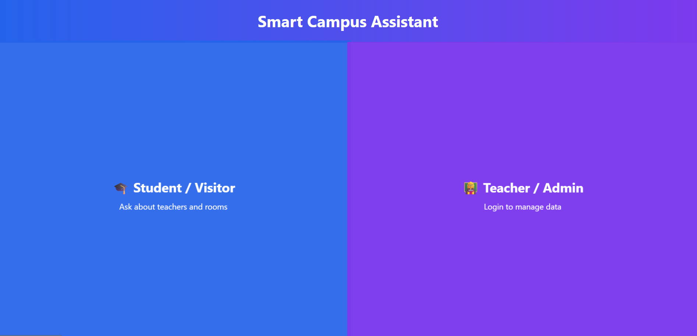
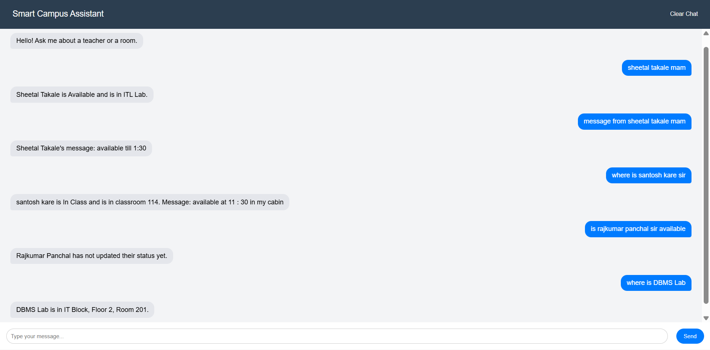
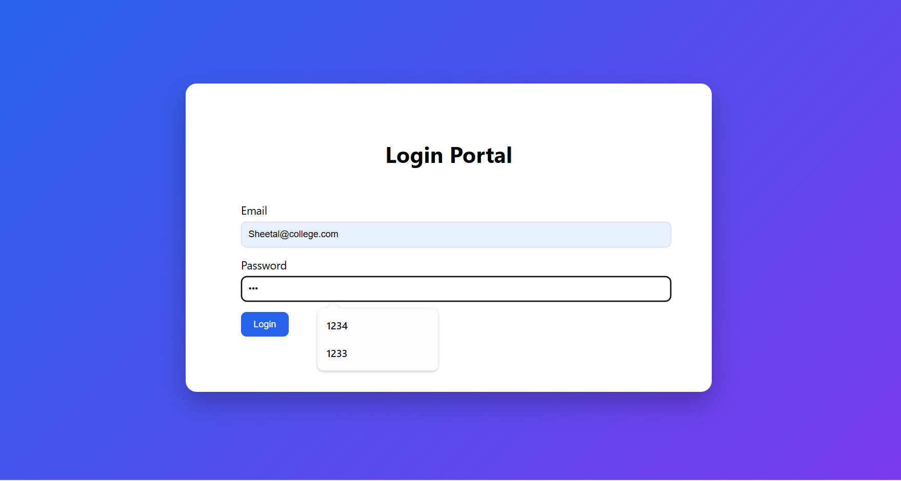
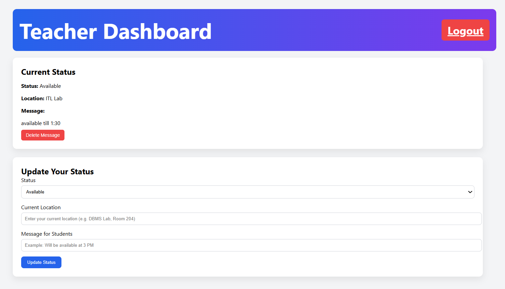
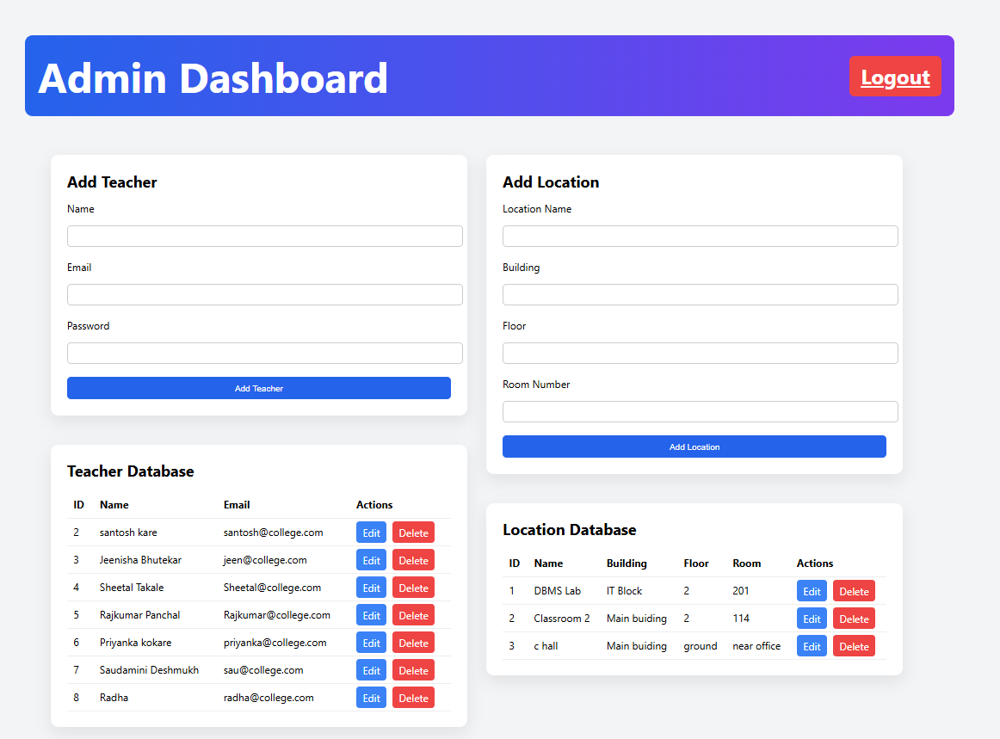

🎓 Smart Campus Assistant

A rule-based campus information system that helps students instantly find teacher availability, messages, and room locations — eliminating unnecessary waiting time.
# 🎓 Smart Campus Assistant

> **A rule-based campus information system that helps students instantly find teacher availability, messages, and room locations — eliminating unnecessary waiting time.**



---

## 📖 Overview

**Smart Campus Assistant** is a web-based campus information system built with **Python Flask** and **SQLite**, designed to solve a real and everyday problem faced by students — *not knowing where their teacher is or whether they're available.*

Students often waste valuable time searching for teachers during submission periods, project reviews, viva sessions, and academic consultations. This system digitizes that process: teachers update their status in real time, and students simply ask the chatbot.

---

## 🚩 Problem Statement

During assignment submissions, project reviews, and examination periods, students frequently need to meet faculty members. Common challenges include:

- ❌ Students don't know if a teacher is available or busy
- ❌ Teachers may be attending meetings, lectures, or in different locations
- ❌ Students waste long periods waiting outside cabins or labs
- ❌ Locating classrooms and labs is confusing for new students

**Smart Campus Assistant** solves all of this through a simple chatbot interface backed by real-time teacher data.

---

## ✨ Features

### 👨‍🎓 Student / Visitor
- Chatbot-based interface — no login required
- Ask about teacher availability in plain language
- Find teacher's current location
- Read messages left by teachers
- Locate classrooms and labs

### 👨‍🏫 Teacher Dashboard
- Secure email/password login
- Update availability status (Available / Busy / In Meeting)
- Set current location
- Post a message for students
- Delete outdated messages

### 👨‍💼 Admin Dashboard
- Add, edit, or delete teacher records
- Add, edit, or delete campus locations (rooms, labs, buildings)
- Full CRUD control over the database

### 🤖 Rule-Based Chatbot
Understands natural queries like:
```
Is Sheetal Takale available?
Any message from Sheetal Takale?
Where is Sheetal Takale?
Where is DBMS Lab?
Where is Classroom 114?
```

---

## 📸 Screenshots

### 🏠 Landing Page
Students and teachers choose their respective portals.


---

### 💬 Student Chatbot
Students ask questions about teachers and rooms in plain language.



---

### 🔐 Login Portal
Teachers and admins securely log in with their credentials.



---

### 👨‍🏫 Teacher Dashboard
Teachers update their status, location, and messages for students.



---

### 👨‍💼 Admin Dashboard
Admin manages the entire teacher and location database.



---

## 🛠 Tech Stack

| Layer | Technology |
|---|---|
| Frontend | HTML5, CSS3, JavaScript |
| Backend | Python, Flask |
| Database | SQLite |
| Tools | Git, GitHub, VS Code |

---

## 📂 Project Structure

```
Smart_campus/
│
├── app.py                    # Flask application & routes
├── database.db               # SQLite database
├── README.md
│
└── templates/
    ├── index.html            # Landing page (Student / Teacher selection)
    ├── chat.html             # Student chatbot interface
    ├── login.html            # Teacher & Admin login portal
    ├── teacher_dashboard.html # Teacher status update panel
    └── admin_dashboard.html  # Admin management panel
```

---

## 🗄 Database Design

### Teachers Table
| Field | Description |
|---|---|
| id | Unique teacher ID |
| name | Teacher's full name |
| email | Login email |
| password | Login password |
| status | Available / Busy / In Meeting |
| location | Current location on campus |
| message | Message visible to students |

### Locations Table
| Field | Description |
|---|---|
| id | Unique location ID |
| name | Location name (e.g., DBMS Lab) |
| building | Building name |
| floor | Floor number |
| room | Room number |

---

## ⚙️ Installation & Setup

### Prerequisites
- Python 3.x installed
- pip (Python package manager)

### Step 1 — Clone the Repository
```bash
git clone https://github.com/jeenisha/Smart_campus.git
cd Smart_campus
```

### Step 2 — Install Dependencies
```bash
pip install flask
```

### Step 3 — Run the Application
```bash
python app.py
```

### Step 4 — Open in Browser
```
http://127.0.0.1:5000
```

That's it! No complex setup, no environment variables, no external services needed.

---

## 🔄 How It Works

```
Teacher logs in
      │
      ▼
Updates: Status + Location + Message
      │
      ▼
Data saved to SQLite Database
      │
      ▼
Student opens chatbot
      │
      ▼
Student types a natural language query
      │
      ▼
Rule-based engine matches query → fetches data
      │
      ▼
Chatbot displays instant response
```

---

## 💬 Sample Chatbot Queries

| Student Asks | Bot Responds |
|---|---|
| `is sheetal takale available` | Sheetal Takale is currently Available. |
| `message from sheetal takale` | Sheetal Takale's message: available till 1:30 |
| `any message from sheetal takale` | Sheetal Takale is Available and is in ITL Lab. |
| `where is classroom 114` | Classroom 2 is in Main Building, Floor 2, Room 114. |
| `where is dbms lab` | DBMS Lab is in IT Block, Floor 2, Room 201. |

---

## 🚀 Future Enhancements

- [ ] AI/NLP-based chatbot using Gemini API for smarter query understanding
- [ ] Voice-enabled assistant
- [ ] Mobile-responsive redesign / PWA
- [ ] Faculty timetable integration
- [ ] Real-time notifications for students
- [ ] QR-code based room navigation
- [ ] Multi-language support (Marathi, Hindi)
- [ ] Attendance system integration
- [ ] Campus event announcements

---

## 📚 What I Learned

Building this project gave me hands-on experience with:

- Flask Web Development (routing, templates, sessions)
- Database management using SQLite with CRUD operations
- Designing a rule-based chatbot without ML frameworks
- Frontend development with HTML, CSS, JavaScript
- Authentication systems (login/logout with sessions)
- Solving real campus problems using technology

---

## 👩‍💻 Author

**Jeenisha Bhutekar**
B.Tech — Information Technology

Passionate about building real-world solutions that improve everyday experiences — especially at the intersection of web development, AI, and campus life.

[](https://github.com/jeenisha)

---

> *"Built to solve a real problem — because the best projects start with genuine frustration."*
